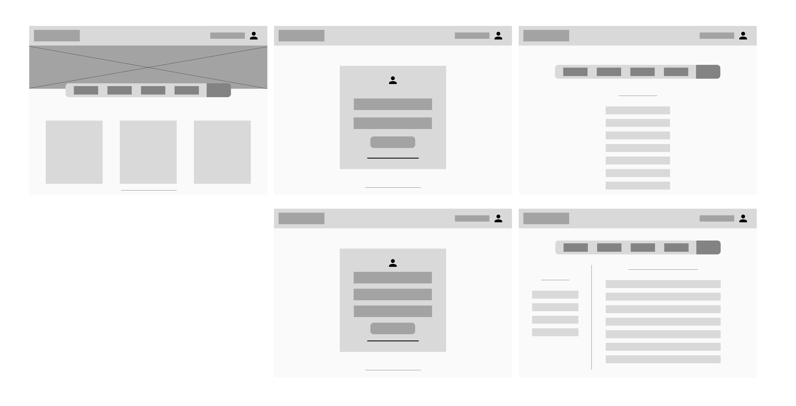
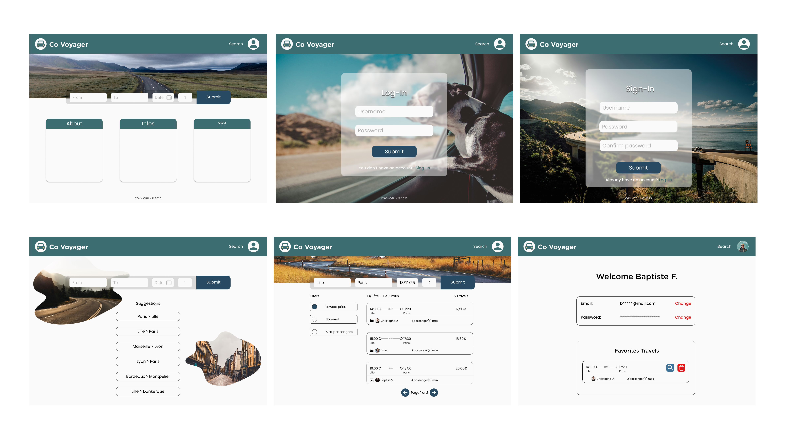
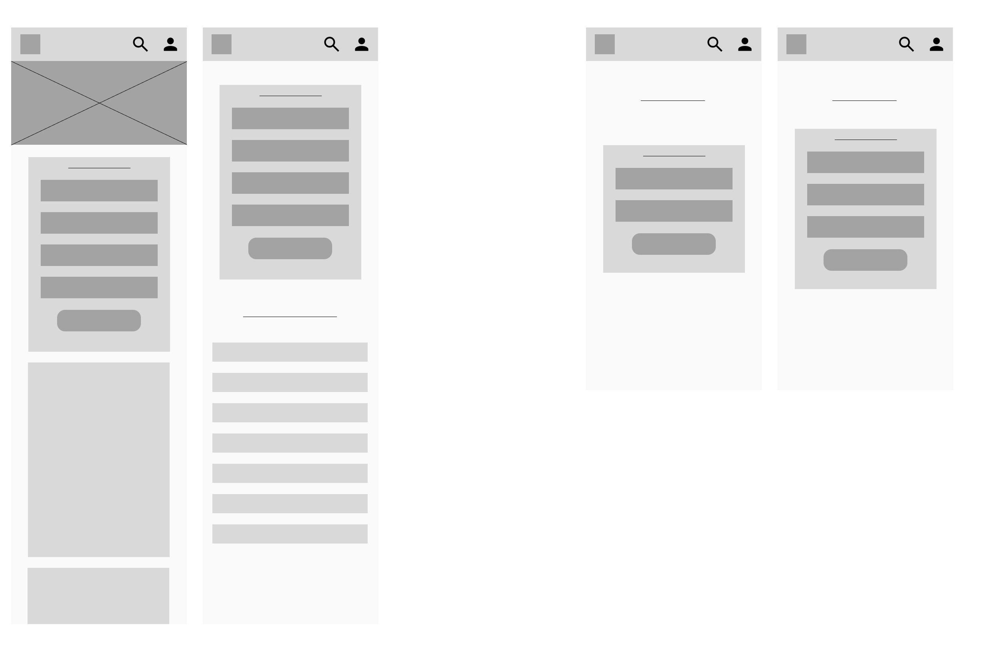
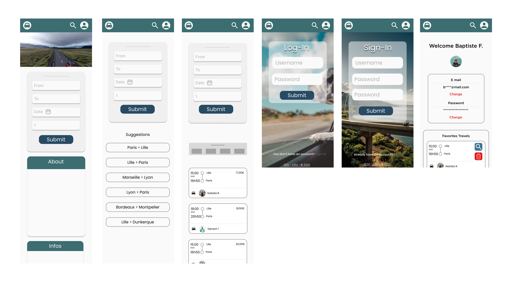
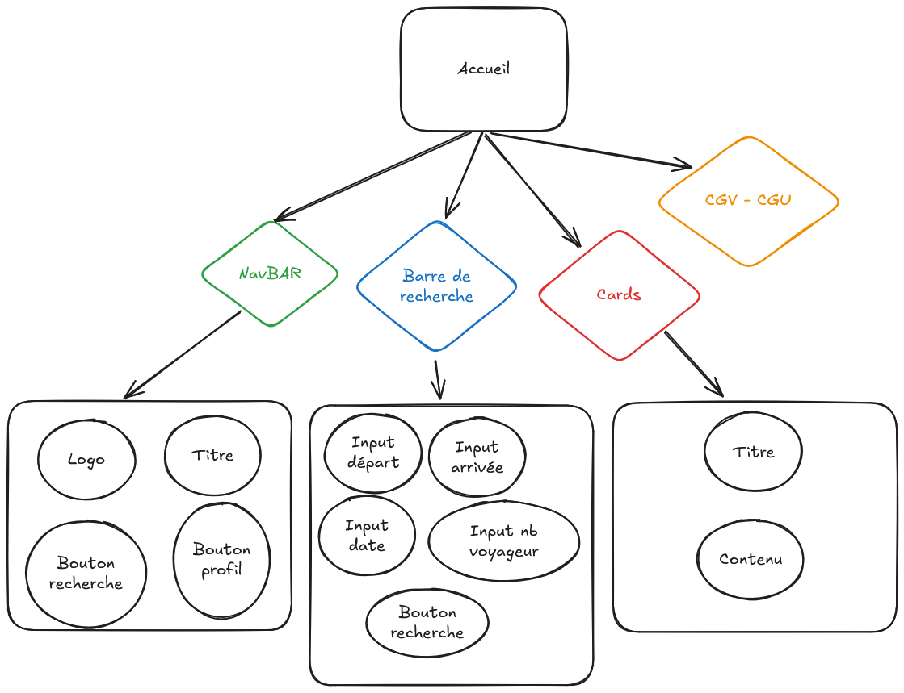

# Documentation Technique CO VOYAGER

# Utilisation de l’application

<aside>
💡

Insérer ici la description détaillée du fonctionnement de l’application

</aside>

# Design

Wireframe Web App

Maquette Web App

Wireframe Phone App

Maquette Phone App

# Code

<aside>
💡

Insérer ici la description non détaillée du code en général (méthodes utilisées, architecture, Déploiement)

</aside>

## FrontEnd

<aside>
💡

Insérer ici la description détaillée de la partie frontend

</aside>

## BackEnd

<aside>
💡

Insérer ici la description détaillée de la partie backend

</aside>

# Composants Front :

## Accueil

- Nav bar [Logo, Titre, Bouton de recherche, Bouton Profil ]
- Barre de recherche [Input départ, Input Arrivée, Input Date, Input nombre de voyageurs , Bouton de lancement de recherche]
- Cards [Titre, Contenu]
- CGV-CGU

Diagramme des composants de la page d’accueil

## Login

- Nav bar
- Card [Titre , Input username, Input Password, Bouton submit, Accès page Sign-in]
- CGV-CGU

Diagramme des composant de la page Login

## Sign-in

- Nav bar
- Card [Titre, Input Username, Input Password, Input Confirm Password, Bouton Submit, Accès page Log-in]
- CGV-CGU

Diagramme des composants de la page Sign-in

## Page de recherche

- Nav bar [Logo, Titre, Bouton de recherche, Bouton Profil ]
- Barre de recherche [Input départ, Input Arrivée, Input Date, Input nombre de voyageurs , Bouton de lancement de recherche]
- Liste de suggestions des trajets les plus empruntés
- CGV-CGU

Diagramme des composants de la page de recherche

## Page de recherche - suite

- Nav bar [Logo, Titre, Bouton de recherche, Bouton Profil ]
- Barre de recherche [Input départ, Input Arrivée, Input Date, Input nombre de voyageurs , Bouton de lancement de recherche] (informations préremplies par l’utilisateur, possibilité de modification)
- Filtres: possible de filtrer par [prix le plus bas, le plus tôt, nombre de passagers maximums ]
- Suggestion de trajets par apport à la recherche **
1. [Date, départ>arrivé, nb de trajets trouvés]
2. Card [Heure départ, temps de trajet, Heure d’arrivée, Prix, Nom des villes, nom du conducteur, nb de passagers max]
3. Affichage x3 et nb de pages en fonction de la recherche [Bouton retour, numéro de page, bouton suivant]
- CGV-CGU

Diagramme des composant de la page recherche une fois avoir lancé la recherche

## Page Profil

- Nav bar [Logo, Titre, Bouton de recherche, Bouton Profil ]
- Titre de bienvenue + nom d’utilisateur avec photo de profil
- Card modification [Email, bouton changement de mail, mot de passe, bouton changement de mot de passe]
- Card favoris [COMPOSANT TRAJET + boutons supprimer et lancer la recherche par apport aux informations du trajet (pas du conducteur)]
- CGV-CGU

Diagramme des composant de la page profil